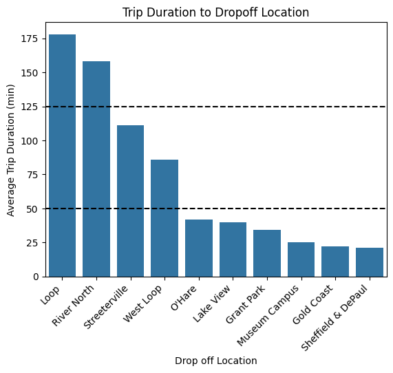
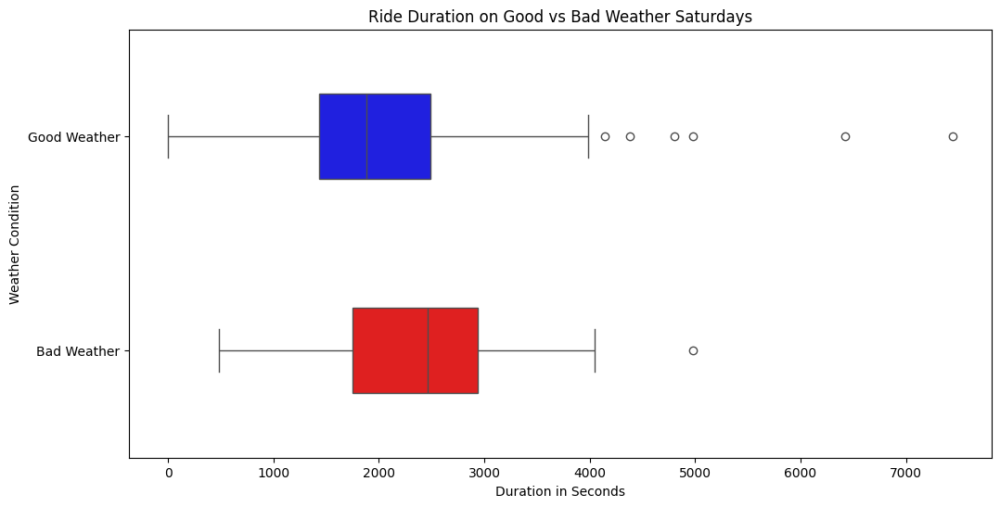

# 📘 Megaline Subscriber Behavior Analysis with SQL
This project focuses on analyzing subscriber behavior using SQL queries. The goal is to extract insights from the dataset, support strategic decision-making in the telecom sector, and optimize marketing efforts.

## 🚀 Features
- **Data Extraction**: Querying and retrieving subscriber data from the database.
- **Data Cleaning**: Using SQL to clean and preprocess data for analysis.
- **Exploratory Data Analysis (EDA)**: Identifying trends, patterns, and correlations directly through SQL queries.
- **Insights Generation**: Extracting actionable insights to reduce churn and improve customer retention. 

## 📊 Visuals

This project includes visualizations generated from SQL query results to help interpret subscriber behavior and trends. Visuals such as charts and graphs are created using Python libraries (e.g., matplotlib, seaborn) within the Jupyter Notebook to support data-driven insights and recommendations. 

 

In this section, I analyzed the top 10 neighborhoods for drop-offs and observed a staggered pattern in trip durations. The Loop and River North emerged as the neighborhoods with the longest average trip durations, significantly outpacing other locations. To better understand this trend, I visualized the data using bar plots and converted trip durations from seconds to minutes for easier interpretation.

Key observations include:
- The Loop and River North have the longest average trip durations, with noticeable gaps between them and other neighborhoods.
- The data revealed distinct breaks in trip durations, highlighting clusters of neighborhoods with similar trip lengths.

This analysis provided insights into trip patterns and helped identify areas with higher demand or longer travel times. 

 

This graph was used to test the hypothesis that weather conditions in Chicago impact ride share travel times between The Loop and O'Hare International Airport.

Key findings:
- On bad weather days, even the shortest trips take longer than those on good weather days.
- The interquartile range for trip durations is generally higher on bad weather days, indicating greater variability.
- The mean trip duration on bad weather days is approximately equal to the upper quartile (75th percentile) of good weather days.
- There are six outliers on good weather days, compared to only one on bad weather days.

## 📦 Installation

```bash
# Clone the repository
git clone https://github.com/Vyncent-vdW/sprint_six_sql_project.git

# Navigate into the project directory
cd sprint_six_sql_project
```

## 🛠️ Usage
Run the Jupyter Notebook to execute the SQL workflow:

```bash
jupyter notebook sprint_six_sql_nb.ipynb
``` 

Key steps include:

- Loading the dataset into a SQL database.
- Writing and executing SQL queries to explore and analyze the data.
- Performing exploratory data analysis (EDA) to identify key trends and relationships.
- Extracting insights to support customer retention strategies and marketing optimization.

## ✅ Requirements 
- Python 3.8+
- pandas
- SQLAlchemy
- SQLite (or another SQL database)
- Jupyter Notebook 

Install them with: 
```bash
pip install -r requirements.txt
``` 

## 🙋 Contributing
Feel free to fork this repo and improve it. If you’ve got enhancements (e.g., optimized queries, new insights, or additional features), submit a pull request:

1. Fork the repo

2. Create a new branch: git checkout -b feature-name

3. Commit your changes: git commit -m "Add improvement"

4. Push to your fork: git push origin feature-name

5. Submit a pull request 

## ✨ Acknowledgements 
TripleTen Taxi Cab dataset source: 

- https://practicum-content.s3.us-west-1.amazonaws.com/learning-materials/data-analyst-eng/moved_project_sql_result_01.csv
- https://practicum-content.s3.us-west-1.amazonaws.com/learning-materials/data-analyst-eng/moved_project_sql_result_04.csv 
- https://practicum-content.s3.us-west-1.amazonaws.com/learning-materials/data-analyst-eng/moved_project_sql_result_07.csv-